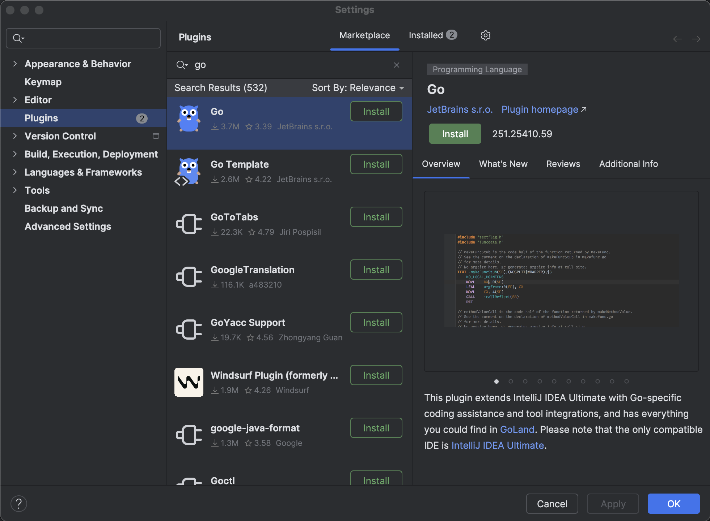
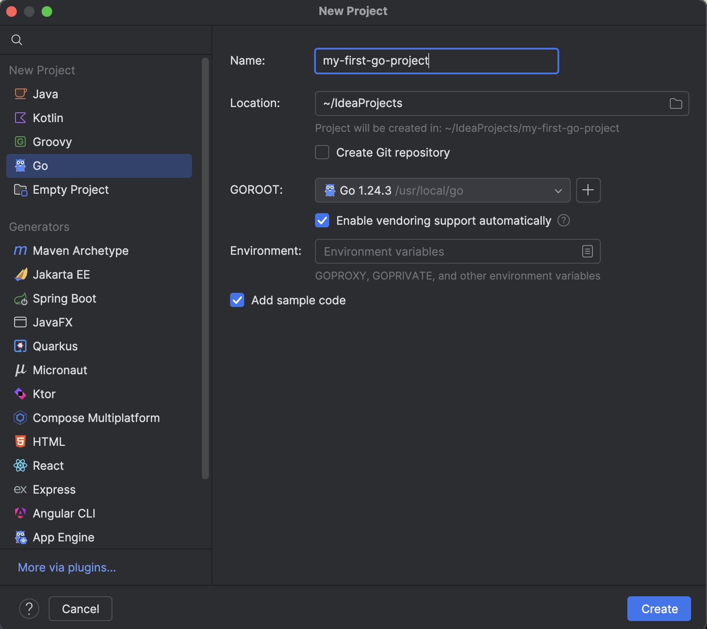
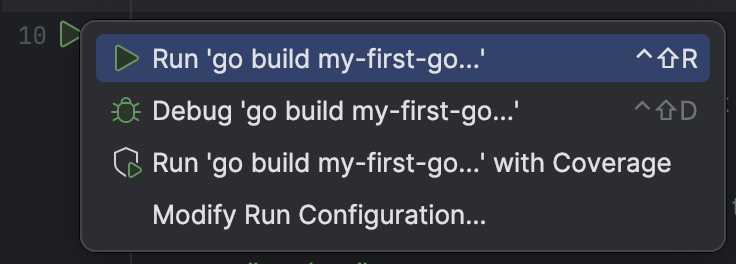

# Setting up IntelliJ for Go development
[Prerequisites](#prerequisites) \
[Installing the Go plugin for IntelliJ](#installing-the-go-plugin-for-intellij) \
[Creating a new Go project](#creating-a-new-go-project) \
[Opening an existing Go project](#opening-an-existing-go-project)

This tutorial will walk you through setting up your IntelliJ environment for developing in Go.

## Prerequisites
Before you begin, ensure you have the following installed:

* IntelliJ IDEA (for more information, see the [IntelliJ IDEA site](https://www.jetbrains.com/idea/download/))  
* Go (for more information, see the [Go documentation](https://go.dev/doc/install))  

## Installing the Go plugin for IntelliJ
Before creating or opening a Go project, you will first need to install the Go plugin.

1. Open IntelliJ IDEA. Go to **Settings** > **Plugins**. Search for “Go”.   
2. Ensure the **Go** plugin is selected and click **Install**.  
   
3. Click **Restart IDE**. Follow the prompts to restart IntelliJ.

## Creating a new Go project
To create and set up a new Go project, complete the following instructions:

1. Open IntelliJ IDEA.   
2. Select **New Project**.  
3. In the left menu, select **Go**. Ensure that the **GOROOT** field points to your Go installation (i.e. `/usr/local/go`).   
   ⚠️ If the “Go” option doesn't appear, ensure the plugin is fully installed and IntelliJ has been restarted.  
   
4. Enter an appropriate name in the **Name** field. Click **Create**.
5. IntelliJ creates a simple Go project with a sample main.go file. To run the project, click the green play button next to the `main()` function definition. Click **Run ‘go build <project_name>’**.  
     
6. The Go project is built and executed, printing output in the **Run** tool window.

## Opening an existing Go project
1. Go to **File** > **Open**.  
2. Navigate to your Go project directory and select it.  
3. IntelliJ will auto-detect the Go modules and SDK.

## Summary
You have successfully set up IntelliJ IDEA for Go development. You can now create, run, and debug Go programs within your IDE.